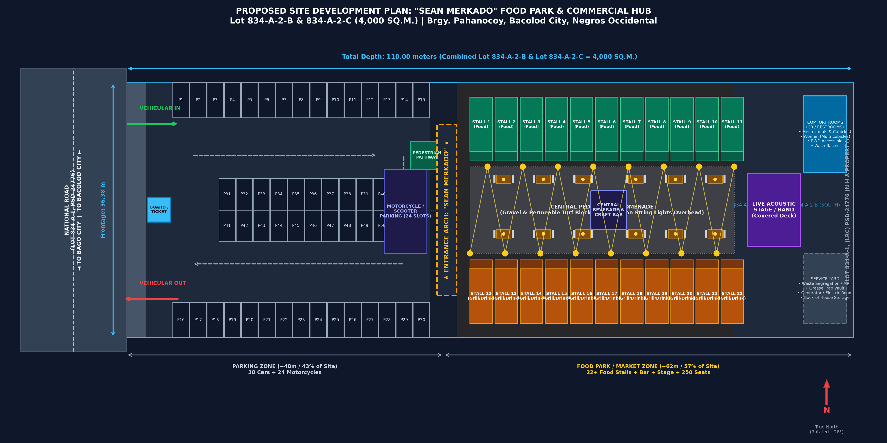
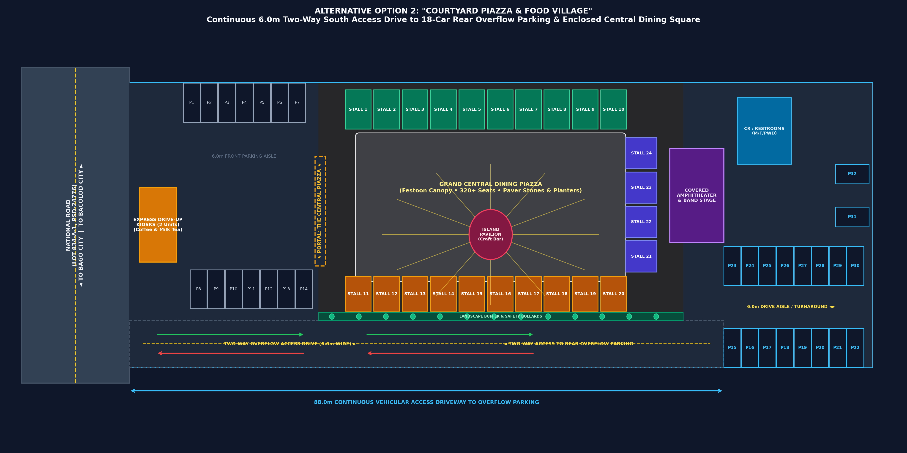
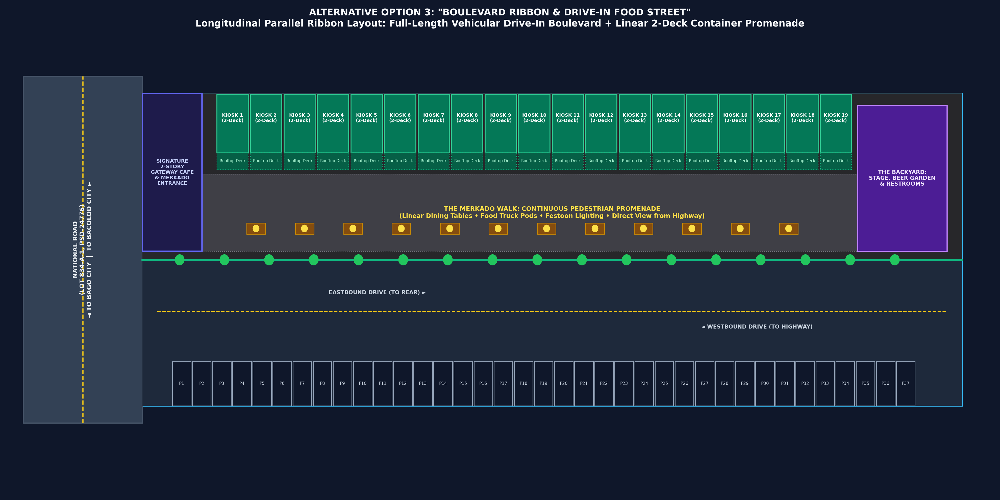
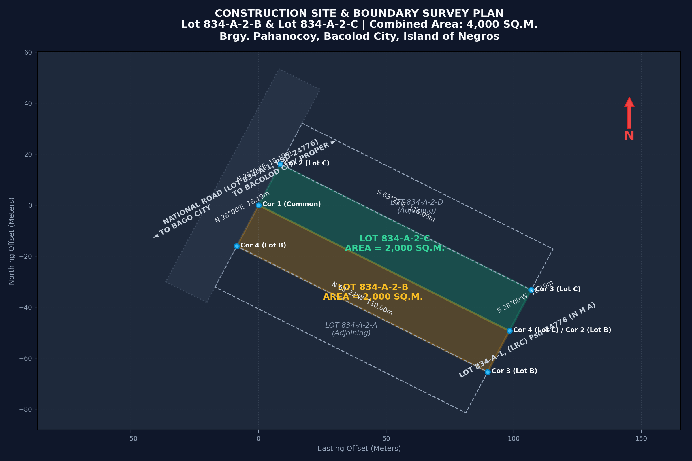

# Sean Merkado — Alternative Site Development Plans
**Property:** Combined Lot 834-A-2-B &amp; Lot 834-A-2-C, Plan (LRA) PSD-408589  
**Location:** National Road, Brgy. Pahanocoy, Bacolod City, Negros Occidental  
**Total Parcel Area:** 4,000.00 sq.m (0.40 Hectares)  
**Dimensions:** 36.38 meters (Frontage) × 110.00 meters (Depth)  
**Live Interactive Application:** [https://surprised-potato.github.io/Sean-Merkado/](https://surprised-potato.github.io/Sean-Merkado/)  

---

## Comparative Master Plan Matrix

| Feature / Criteria | Option 1: Linear Split (Baseline) | Option 2: Courtyard Piazza | Option 3: Boulevard Ribbon |
| :--- | :--- | :--- | :--- |
| **Design Concept** | Front parking zone + rear pedestrian promenade | Enclosed central dining square with U-shaped stalls | Longitudinal parallel drive-in street + 2-story containers |
| **Highway Exposure** | Visible front parking lot & entrance arch | Front drive-up express kiosks & portal | Full 110m continuous view into the vibrant food street |
| **Car Parking Capacity** | **38 Cars** (Front lot) | **32 Cars** (14 Front + 18 Rear) | **40 Cars** (Full-length angled ribbon) |
| **Motorcycle Capacity** | **24 Slots** | **20 Slots** | **30 Slots** |
| **Food Kiosk Count** | **22 Stalls** + Central Bar | **26 Stalls** + Center Pavilion | **19 Two-Story Stalls** (38 total vendor bays/decks) |
| **Dining Seating** | ~260 Seats (Promenade picnic) | **~320 Seats** (Grand central square) | **~350 Seats** (Ground strip + Rooftop decks) |
| **Vehicular Circulation** | One-way counter-clockwise loop | Continuous 6.0m two-way South Overflow Access Drive | Full-length two-way boulevard (8m aisle) |
| **Pedestrian Ambiance** | Authentic night market gravel walk | Intimate European-style market square | Trendy urban multi-level food street |
| **Phase Development** | Simple 2-stage (front then rear) | Multi-stage (front, piazza, rear) | Highly modular (develop north half, south as parking) |

---

## 1. Option 1: Linear Front-to-Back Split (Baseline Scheme)

### Concept & Space Allocation:
- **Zoning Strategy:** Clean front-to-back division.
  - **Front 47 meters (~1,710 m² / 42.7%):** Dedicated to customer parking (38 car slots + 24 motorcycle bays) with a 6-meter one-way circulation loop, security guardhouse, and marked pedestrian walkway.
  - **Rear 63 meters (~2,290 m² / 57.3%):** Dedicated to the "Sean Merkado" pedestrian food market inspired directly by the reference photo (gravel & concrete turf paver promenade, overhead festoon lights, 22 container kiosks, central beverage bar, covered acoustic music stage, and rear comfort rooms).
- **Key Advantage:** 100% vehicle-free pedestrian safety inside the dining area; buffers diners from national highway dust and noise.

---

## 2. Option 2: "Courtyard Piazza & Food Village"

### Concept & Space Allocation:
- **Zoning Strategy:** Concentric community square / U-shaped village enclosing a grand social dining piazza with an unobstructed vehicular link to rear parking.
  - **South Overflow Access Drive (0m to 88m):** A dedicated 6.0m two-way paved roadway running continuously along the southern perimeter, enabling customers to drive directly from the National Road frontage to the rear overflow parking lot without cutting through the dining areas. Buffered by safety bollards and landscaping.
  - **Front Zone (0m to 28m):** 14 quick-turnover parking stalls (P1–P14) plus **2 Express Highway Drive-Up Kiosks** (specializing in morning coffee, milk tea, and grab-and-go snacks for highway commuters).
  - **Central Courtyard Piazza (28m to 82m):** A spacious $39\text{m} \times 18\text{m}$ open-air dining square enclosed on three sides by 26 food kiosks, anchored by a central circular craft bar pavilion and a radial festoon lighting canopy.
  - **Rear Hub (82m to 110m):** 18 secondary/overflow parking stalls (P15–P32) with a 5.5m drive aisle and hammerhead turnaround, covered acoustic amphitheater stage, and sanitary restroom building.
- **Key Advantage:** Creates an intimate, festival-square dining ambiance shielded completely from vehicle traffic, while maintaining smooth, direct vehicular circulation between highway frontage and rear overflow parking.

---

## 3. Option 3: "Boulevard Ribbon & Drive-In Food Street"

### Concept & Space Allocation:
- **Zoning Strategy:** Longitudinal parallel ribbon split running the full 110-meter depth.
  - **South Ribbon (17.0m wide):** Two-way drive-in vehicular boulevard with a continuous ribbon of **40 angled parking spaces** running from the highway all the way to the rear boundary.
  - **North Ribbon (19.4m wide):** "The Merkado Walk" — a pedestrian food street featuring **19 two-story modified shipping container kiosks** with 2nd-floor rooftop dining decks overlooking the street, a front 2-story signature gateway cafe, central al fresco dining tables, and a rear "Backyard" beer garden & stage.
- **Key Advantage:**
  - **Unmatched Commercial Visibility:** Motorists on the National Road can see the entire 110-meter vibrant food street lit up deep into the property.
  - **"Park & Dine" Convenience:** Customers can park directly adjacent to their preferred kiosk.
  - **2-Story Rooftop Seating:** Doubles the usable seating area and provides an elevated vantage point.

---

## Technical Survey Reference (PSD-408589)

- **Lot 834-A-2-C (North Lot):** 2,000.00 sq.m (Frontage: 18.19m along National Road, Depth: 110.00m)
- **Lot 834-A-2-B (South Lot):** 2,000.00 sq.m (Frontage: 18.19m along National Road, Depth: 110.00m)
- **Combined Area:** 4,000.00 sq.m (36.38m frontage × 110.00m depth)
- **Tie Line:** From BBM No. 2, CAD 39 Bacolod Cadastre to Corner 1: **S. 26° 13' W, 711.62 m**
